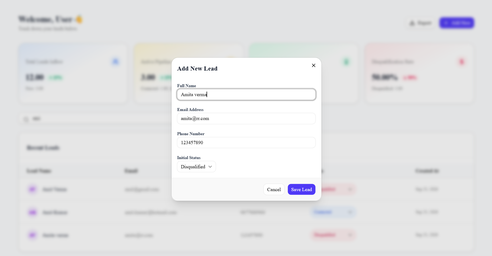
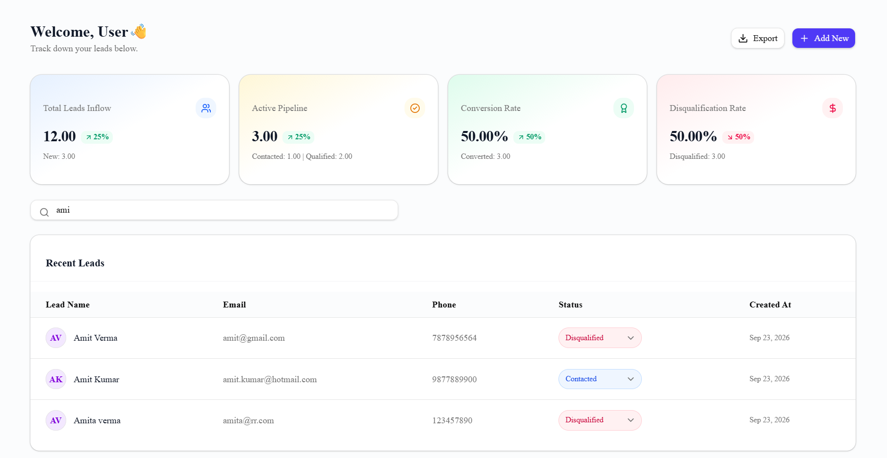
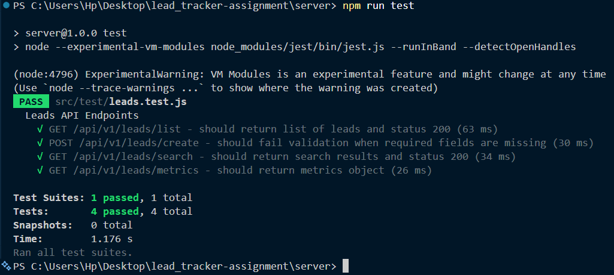

# Lead Tracker Application

A full-stack lead management platform built with Next.js, Node.js, Express.js, and MongoDB. The application provides real-time search, metrics tracking, lead status management, and query-aware CSV data export.

---

## 🔗 Live Links & Media

* **Frontend App:** [Live Dashboard](https://lead-tracker-assignment-tau.vercel.app/dashboard)
* **Backend API:** [API Server](https://lead-tracker-server.onrender.com/api/v1/healthcheck)
* **Video Walkthrough:** [Watch YouTube Demo](https://www.google.com/search?q=YOUR_YOUTUBE_LINK_HERE&utm_source=gemini)

---

## 📸 Screenshots

| Add New Lead | Search & Export Feature |
| :---: | :---: |
|  |  |

---

## 🏗️ Architecture

The application is built using a modern decoupled full-stack architecture:

* **Frontend:** Next.js (App Router), React, TanStack Query (`@tanstack/react-query`) for state management and caching, Tailwind CSS, Shadcn UI, and Lucide React icons.
* **Backend:** Node.js, Express.js REST API with Mongoose ORM for data modeling and validation.
* **Database:** MongoDB Atlas instance with query indexing for performant search.
* **Testing:** Jest & Supertest for backend integration tests.

---

## ✨ Features

* **Lead Management:** View, search, and add new leads.
* **Dashboard Metrics[BONUS]:** Real-time summary cards displaying key metrics.
* **Query-Aware CSV Export [BONUS]:** Export lead records directly to CSV format with active search filters preserved.
* **Optimistic UI & Caching:** Powered by TanStack Query for smooth transitions and minimal redundant network calls.

---

## 🧪 Testing
### Running Backend Tests
Navigate to the server directory and execute Jest:
```
npm run test
```



- [Postman server API Collection](https://github.com/Shrey-Raj/lead-tracker-assignment/blob/main/server/lead-tracker.postman_collection.json)

- Automated testing is implemented exclusively on the server side to ensure API contract integrity, controller logic reliability, and database interaction accuracy.


## 🚀 Setup Instructions

### Prerequisites

* Node.js (v24 or higher)
* MongoDB running locally or a MongoDB Atlas URI

### 1. Repository Setup

```bash
git clone https://github.com/Shrey-Raj/lead_tracker-assignment.git
cd lead_tracker-assignment

```

### 2. Backend Setup

```bash
cd server
npm install

```

Create a `.env` file in the `server` directory:

```env
PORT=8080
MONGO_URI=mongodb+srv://<username>:<password>@cluster.mongodb.net/lead_tracker
NODE_ENV

```

Start the development server and run tests:

```bash
# Start backend
npm run dev

# Run backend tests
npm test

```

### 3. Frontend Setup

```bash
cd ../client
npm install

```

Create a `.env.local` file in the `client` directory:

```env
NEXT_PUBLIC_API_BASE_URL=http://localhost:8080/api/v1

```

Start the development server and run tests:

```bash
# Start frontend
npm run dev

# Run frontend tests
npm test

```

---

## 🌐 Deployment Steps

### Backend (Deployed on Render)

* Repository connected to Render web service.
* Root directory targeted to `server`
* **Build Command:** `npm install`
* **Start Command:** `node index.js` (or `npm run dev`)
* **Environment Variables set:** `MONGO_URI`, `PORT`, `NODE_ENV`

### Frontend (Deployed on Vercel)

* Root directory targeted to `client`.
* **Framework Preset** set to Next.js.
* **Environment Variable set:** `NEXT_PUBLIC_API_BASE_URL=[https://lead-tracker-server.onrender.com/api/v1](https://lead-tracker-server.onrender.com/api/v1)`
* Automated deployments configured via GitHub `main` branch triggers.

---

## ⚖️ Trade-offs

* **Client-Side CSV Generation vs Backend Stream:** Implemented CSV parsing(using a library called Papaparse) on the frontend from the queried dataset for faster response times and lower server overhead.
* **In-Memory Cache vs Server Revalidation:** Leveraged TanStack Query in-memory cache strategy over Next.js server-side revalidation to reduce database load on frequent search inputs.
---

## 🔮 Future Improvements

* **Authentication & Roles:** Integrate JWT authentication with role-based access control (Admin vs Representative).
* **Pagination Support:** Server-side pagination for large datasets during search and export.